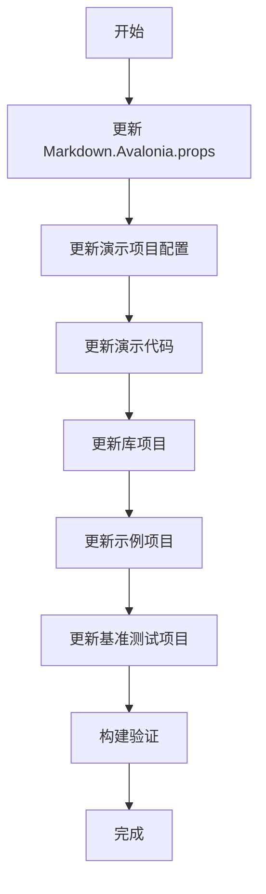

# Markdown.Avalonia 升级到 .NET 10 和 Avalonia 12 计划

## 概述

本计划详细说明了将 Markdown.Avalonia 项目从当前配置（.NET Framework/Standard/6/7 和 Avalonia 11）升级到 .NET 10 和 Avalonia 12 所需的全部修改。

## 当前状态分析

### 现有配置 (Markdown.Avalonia.props)

| 属性 | 当前值 |
|------|--------|
| PackageTargetFrameworks | net461;netstandard2.0;net6 |
| DemoAppTargetFrameworks | net461;netcoreapp3.1;net6;net7 |
| AvaloniaVersion | 11.0.0 |
| DemoAvaloniaVersion | 11.0.5 |
| AvaloniaEditVersion | 11.0.0 |
| AvaloniaSvgVersion | 11.0.0 |

---

## 升级任务清单

### 第一阶段: 更新核心配置文件

#### 1.1 修改 Markdown.Avalonia.props

```xml
<!-- 修改前 -->
<PropertyGroup Condition=" '$(OS)' == 'Windows_NT' ">
  <PackageTargetFrameworks>net461;netstandard2.0;net6</PackageTargetFrameworks>
  <DemoAppTargetFrameworks>net461;netcoreapp3.1;net6;net7</DemoAppTargetFrameworks>
  <TestTargetFrameworks>net6</TestTargetFrameworks>
</PropertyGroup>

<!-- 修改后 -->
<PropertyGroup Condition=" '$(OS)' == 'Windows_NT' ">
  <PackageTargetFrameworks>net8.0;net10.0</PackageTargetFrameworks>
  <DemoAppTargetFrameworks>net8.0;net10.0</DemoAppTargetFrameworks>
  <TestTargetFrameworks>net10.0</TestTargetFrameworks>
</PropertyGroup>
```

```xml
<!-- 修改版本号 -->
<PropertyGroup>
  <AvaloniaVersion>12.0.0</AvaloniaVersion>
  <DemoAvaloniaVersion>12.0.0</DemoAvaloniaVersion>
  <AvaloniaEditVersion>12.0.0</AvaloniaEditVersion>
  <AvaloniaSvgVersion>12.0.0</AvaloniaSvgVersion>
</PropertyGroup>
```

**涉及文件:**
- `Markdown.Avalonia.props`

---

### 第二阶段: 更新演示项目

#### 2.1 替换 Diagnostics 包

**涉及文件:**
- `demos/Markdown.AvaloniaDemo/Markdown.AvaloniaDemo.csproj`
- `demos/Markdown.AvaloniaFluentDemo/Markdown.AvaloniaFluentDemo.csproj`
- `demos/Markdown.AvaloniaFluentAvaloniaDemo/Markdown.AvaloniaFluentAvaloniaDemo.csproj`

**修改内容:**

```xml
<!-- 修改前 -->
<PackageReference Include="Avalonia.Diagnostics" Version="$(DemoAvaloniaVersion)" />

<!-- 修改后 -->
<PackageReference Include="AvaloniaUI.DiagnosticsSupport" Version="2.2.0" />
```

#### 2.2 更新调试工具调用

**涉及文件:**
- `demos/Markdown.AvaloniaDemo/Views/MainWindow.axaml.cs`

```csharp
// 修改前
#if DEBUG
this.AttachDevTools();
// endif

// 修改后
#if DEBUG
this.AttachDeveloperTools();
// endif
```

---

### 第三阶段: 更新库项目

#### 3.1 需要更新的项目文件

以下所有项目文件需要更新目标框架和包版本引用:

| 项目 | 文件路径 |
|------|----------|
| ColorTextBlock.Avalonia | `ColorTextBlock.Avalonia/ColorTextBlock.Avalonia.csproj` |
| ColorDocument.Avalonia | `ColorDocument.Avalonia/ColorDocument.Avalonia.csproj` |
| Markdown.Avalonia.Tight | `Markdown.Avalonia.Tight/Markdown.Avalonia.Tight.csproj` |
| Markdown.Avalonia.Html | `Markdown.Avalonia.Html/Markdown.Avalonia.Html.csproj` |
| Markdown.Avalonia.Svg | `Markdown.Avalonia.Svg/Markdown.Avalonia.Svg.csproj` |
| Markdown.Avalonia.SyntaxHigh | `Markdown.Avalonia.SyntaxHigh/Markdown.Avalonia.SyntaxHigh.csproj` |
| Markdown.Avalonia | `Markdown.Avalonia/Markdown.Avalonia.csproj` |

---

### 第四阶段: 更新示例和测试项目

#### 4.1 需要更新的示例项目

| 项目 | 文件路径 |
|------|----------|
| CustomStyle | `example/CustomStyle/CustomStyle/CustomStyle.csproj` |
| HowToUse | `example/HowToUse/HowToUse/HowToUse.csproj` |

#### 4.2 需要更新的基准测试项目

| 项目 | 文件路径 |
|------|----------|
| MdAvBench | `benchmark/MdAvBench/MdAvBench.csproj` |

---

### 第五阶段: 验证和测试

#### 5.1 构建验证

完成所有修改后，需要执行以下验证:

1. 还原 NuGet 包
2. 编译所有项目
3. 运行演示程序确认功能正常

---

## 关键 Breaking Changes 参考

### Avalonia 12 重要变更

| 变更类型 | 说明 |
|----------|------|
| .NET 支持 | 仅支持 .NET 8+，推荐 .NET 10 |
| 包移除 | Avalonia.Diagnostics 已被移除 |
| 替换包 | 使用 AvaloniaUI.DiagnosticsSupport 替代 |
| API 替换 | AttachDevTools() → AttachDeveloperTools() |
| netstandard2.0 | 已不再支持 |
| net461 | 已不再支持 |

---

## 执行顺序



---

## 注意事项

1. **包版本协调**: 所有 Avalonia 相关包必须使用相同版本（12.0.x）
2. **AvaloniaUI.DiagnosticsSupport**: 这是一个独立包，版本由 Avalonia 项目单独发布
3. **目标框架**: 移除对旧版 .NET Framework 和 .NET Standard 的支持
4. **AvaloniaEdit**: 需要确认 12.0 版本是否可用，如不可用可能需要条件编译

---

## 待确认事项

- [ ] AvaloniaEdit 12.0 版本是否已发布
- [ ] 是否需要保留旧版 .NET 的兼容代码
- [ ] 基准测试项目的目标框架选择
